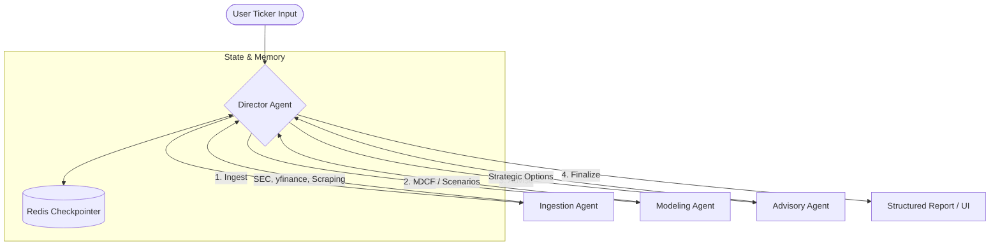

# 💼 finance-copilot

> **Corporate Finance Autopilot** — A multi-agent AI pipeline for automated brand analysis, financial modeling, and strategic advisory.

[](https://github.com/jose-r-morera/finance-copilot/actions/workflows/ci.yml)
[](https://opensource.org/licenses/MIT)

---

## 🎯 Overview

`finance-copilot` is an agentic system designed to automate the heavy lifting of corporate finance analysis. It takes a public company ticker, ingests data from disparate sources (SEC filings, market data, brand materials), builds a triple-case financial model (Base, Upside, Downside), and generates a professional investment/credit case.

### Key Capabilities
- **Dual-Phase Ingestion**:
    - **Structured (yfinance)**: Fetches 5 years of annual financials (Income Statement, Balance Sheet, Cash Flow) and monthly stock prices into **PostgreSQL**.
    - **Unstructured (SEC EDGAR)**: Retrieves 10-K/10-Q filings, chunks them with **LangChain**, and stores embeddings in **ChromaDB** for RAG.
- **Brand & Positioning capture**: Automated scraping of logo, mission, and key facts (using `responsible_scraping` patterns).
- **Enrichment Engine**: Automatically creates company records from the SEC registry and enriches them with real-time market stats (Market Cap, EV, etc.).
- **Financial Reasoning Layer**: Triple-scenario forecasting with sensitizable key drivers.
- **Agentic Pipeline**: Orchestrated via **LangGraph**, using specialized agents for retrieval, calculation, and reporting (with full observability).

---

## 🏗️ Architecture: Multi-Agent Pipeline

The system uses a **Director-Lead** architecture to orchestrate specialized agents:



### Core Agents
- **Director Agent (LangGraph)**: The heart of the system. Manages state, sequences the sub-agents, and handles observability traces.
- **Ingestion Agent**: Fetches financial data (SEC EDGAR, yfinance) and performs brand/positioning web scraping.
- **Modeling Agent**: Responsible for building the triple-scenario (Base, Upside, Downside) financial models with sensitizable drivers.
- **Advisory Agent**: Performs strategic analysis on the modeling output to suggest funding and strategic options (M&A, debt, etc.).

---

---

## 🛠️ Tech Stack & Choices

| Component | Choice | Justification |
| :--- | :--- | :--- |
| **Backend** | **FastAPI** | High performance, native async support, excellent type safety. |
| **Orchestration** | **LangGraph** | Enables cyclic agent workflows and state management for complex multi-step reasoning. |
| **LLMs** | **GPT-4o / Gemini** | High reasoning capability for financial data interpretation. |
| **Data Handling** | **Pandas / Pydantic / SQLModel** | Industry standards for data manipulation, typed validation, and ORM persistence. |
| **Storage** | **Postgres / Redis** | Relational state for data persistence and Redis for caching/agent checkpointers. |
| **Infrastructure** | **Docker Compose** | Ensures reproducibility across environments. |
| **Quality** | **Ruff / Mypy / Pytest** | Modern, fast tooling for linting, type-checking, and testing. |

---

## 🤖 Agentic Development (Antigravity)

This repository includes a `.agents` directory designed specifically for the **Antigravity** developer agent. It contains:
- **Skills**: Specialized instructions for managing the Python environment, Docker operations, and performing responsible web scraping.
- **Workflows**: Automated pipelines for project setup and quality verification.
- **Rules**: Strict development standards for formatting (Ruff), ethics (Responsible Scraping), and architecture (Open Source First).

---

## 🚀 Getting Started

### Prerequisites
- Docker & Docker Compose
- Python 3.11+ (for local dev)
- API Keys (OpenAI, SEC User-Agent, etc.)

### Quick Start (Docker)
1.  **Clone the repo**:
    ```bash
    git clone https://github.com/jose-r-morera/finance-copilot.git && cd finance-copilot
    ```
2.  **Config**:
    ```bash
    cp .env.example .env
    # Edit .env with your real API keys
    ```
3.  **Run**:
    ```bash
    docker compose up --build
    ```
4.  **Verify**: Visit [http://localhost:8000/api/v1/health](http://localhost:8000/api/v1/health)

---

## 🚦 Roadmap (Work Plan)

See [WORKPLAN.md](WORKPLAN.md) for a detailed phased breakdown of the hackathon development.

---

## 📜 Rules & Disclaimers

- **Educational Purpose Only**: This is a student hackathon project.
- **No Investment Advice**: All outputs must be treated as demonstrations, not financial recommendations.
- **Data Usage**: Compliant with SEC EDGAR and yfinance Terms of Service.

---

## ⚠️ Limitations & Data Notes
 
 - **Latency**: Real-time ticker processing takes 1-2 minutes due to multi-agent reasoning depth.
 - **SEC Availability**: EDGAR filings are subject to SEC rate limits; the Ingestion Agent handles retries gracefully.
 - **Model Uncertainty**: Financial forecasts are mathematical extrapolations and do not account for black-swan events.
 
 ---
 
 ## 👥 Authors
- **José Ramón Morera** — [jose-r-morera](https://github.com/jose-r-morera)